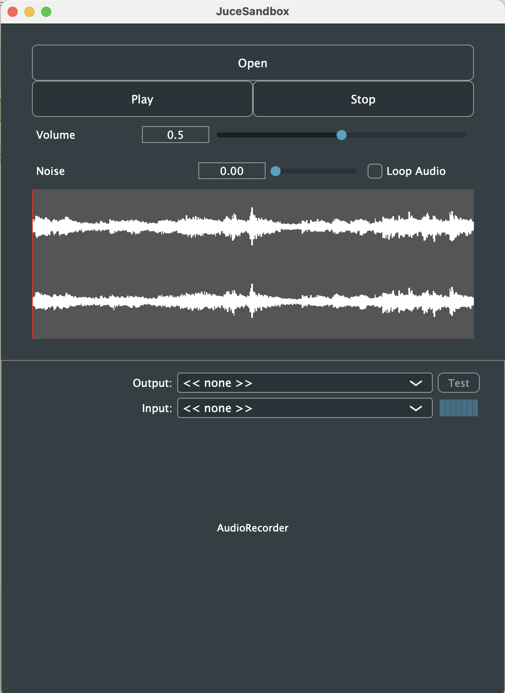

# JUCE Sandbox
A dashboard for learning JUCE and audio development overall. I will continue to add components into the application. The project is loosely based on the official JUCE tutorial and its demo code. 

# UI Snapshot

# Feature List
- Audio Player
    - Play/Pause
    - Looping
- Audio Thumbnail
    - Play Head
- Logging with time and levels
